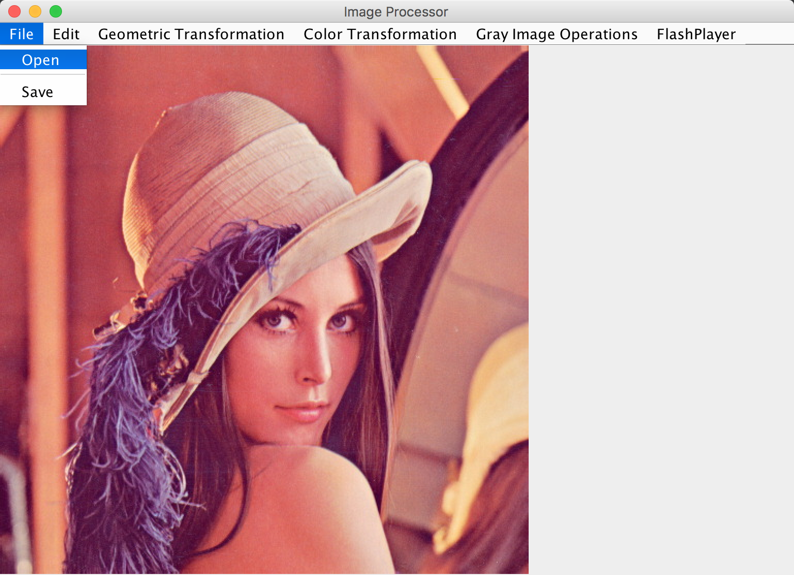
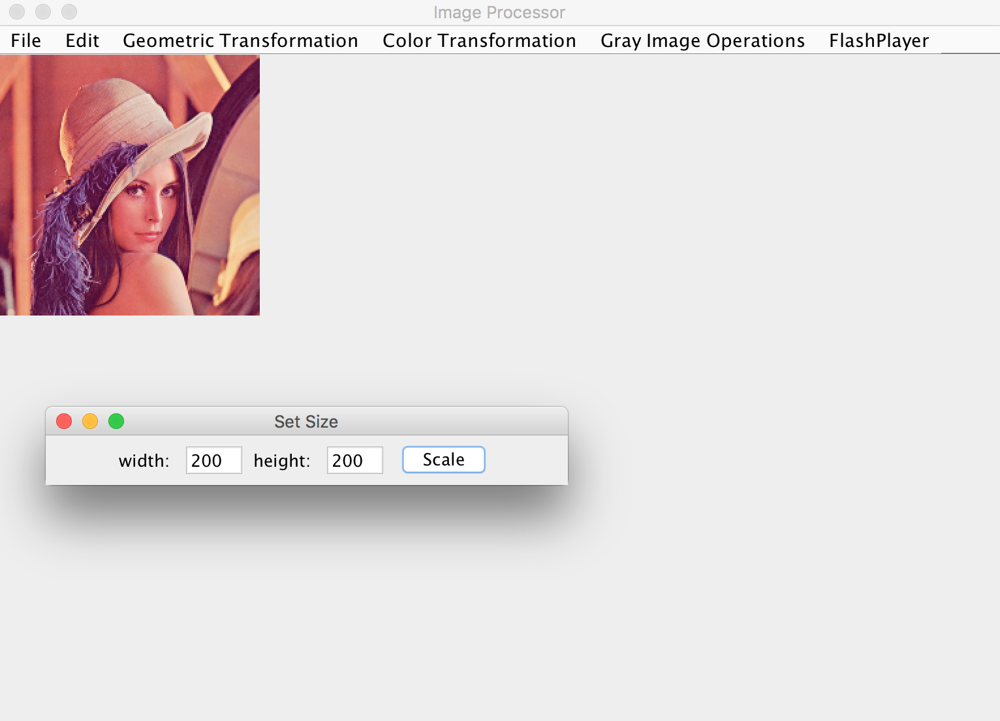
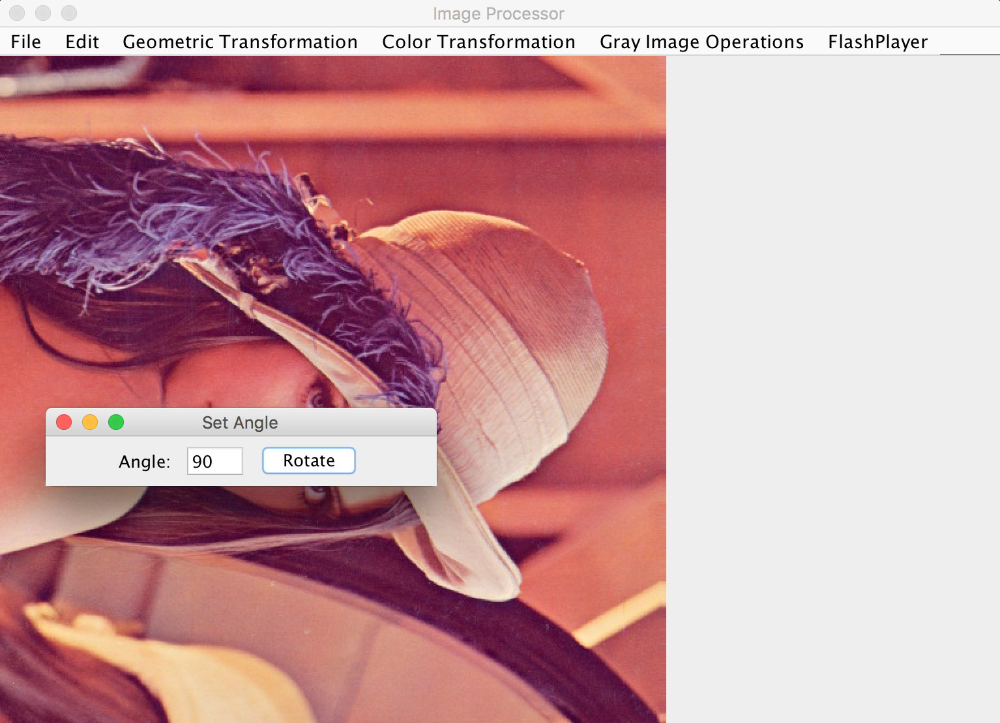
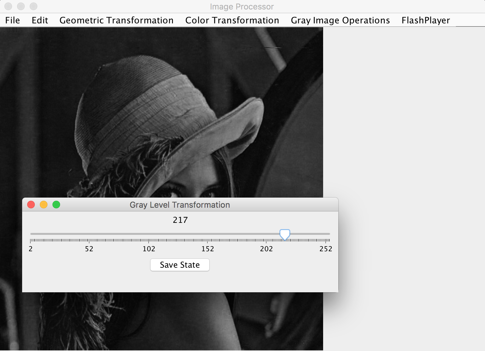
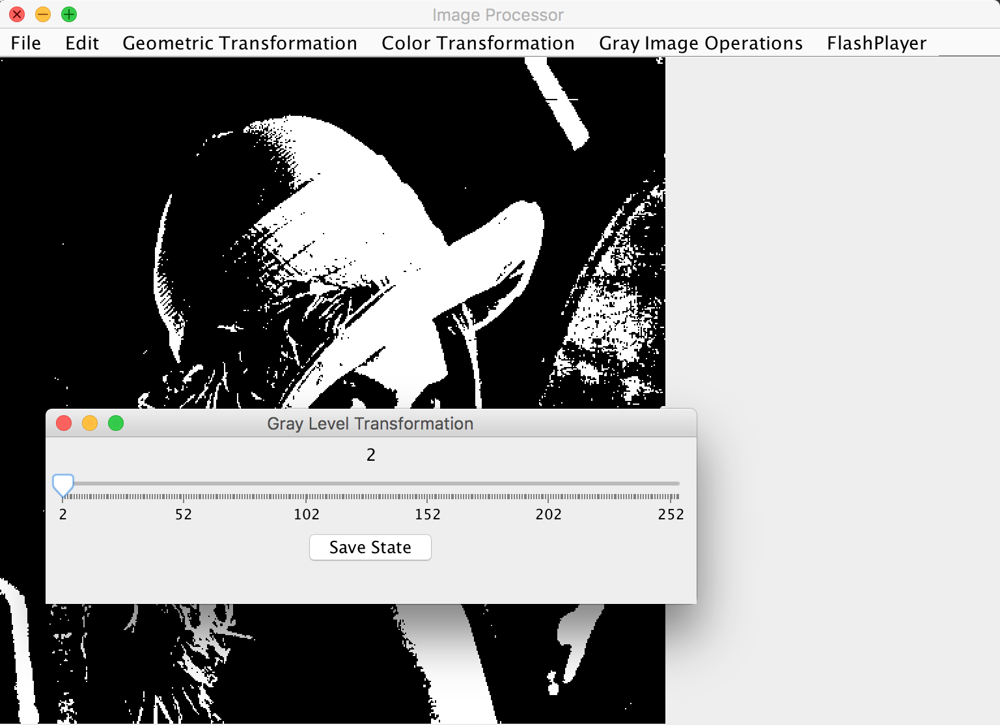
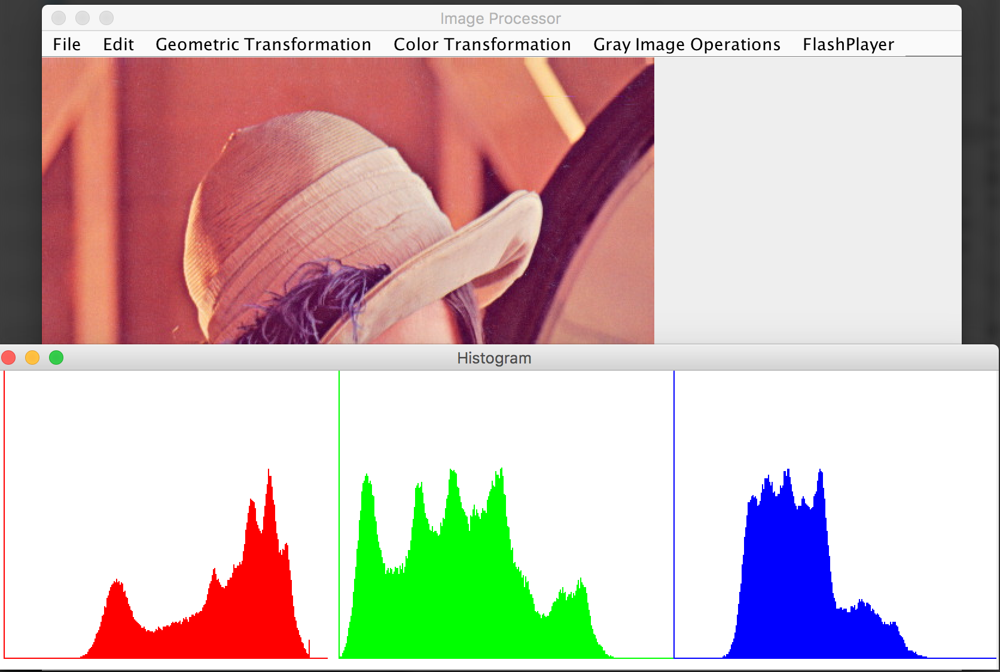
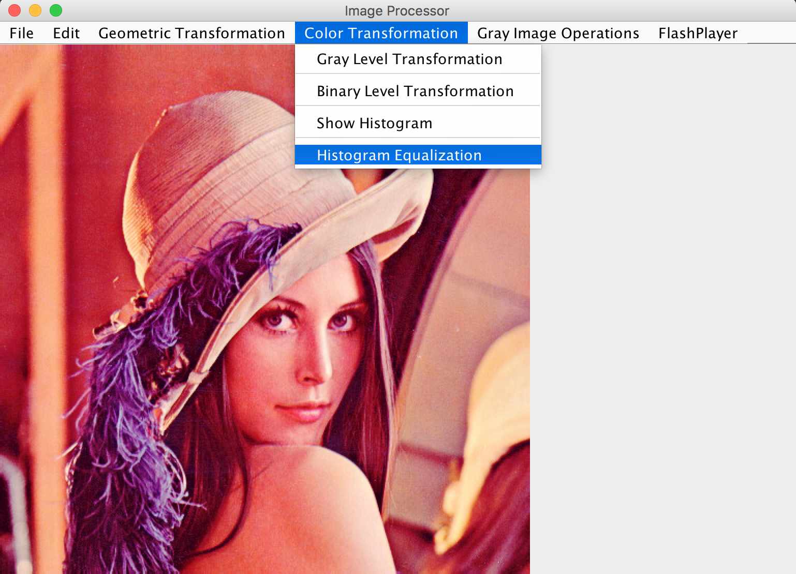
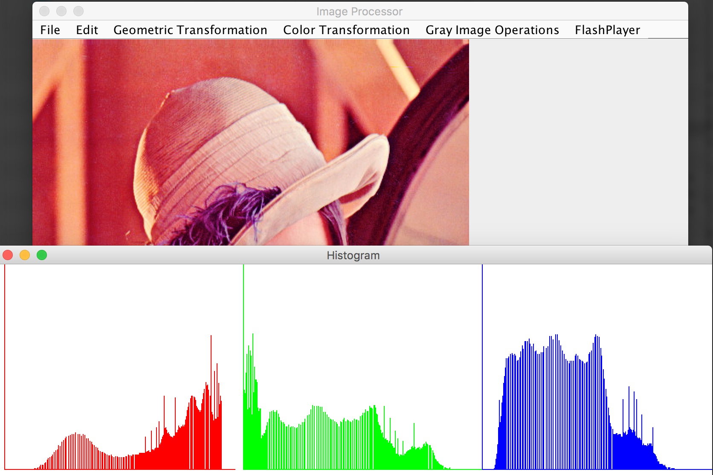
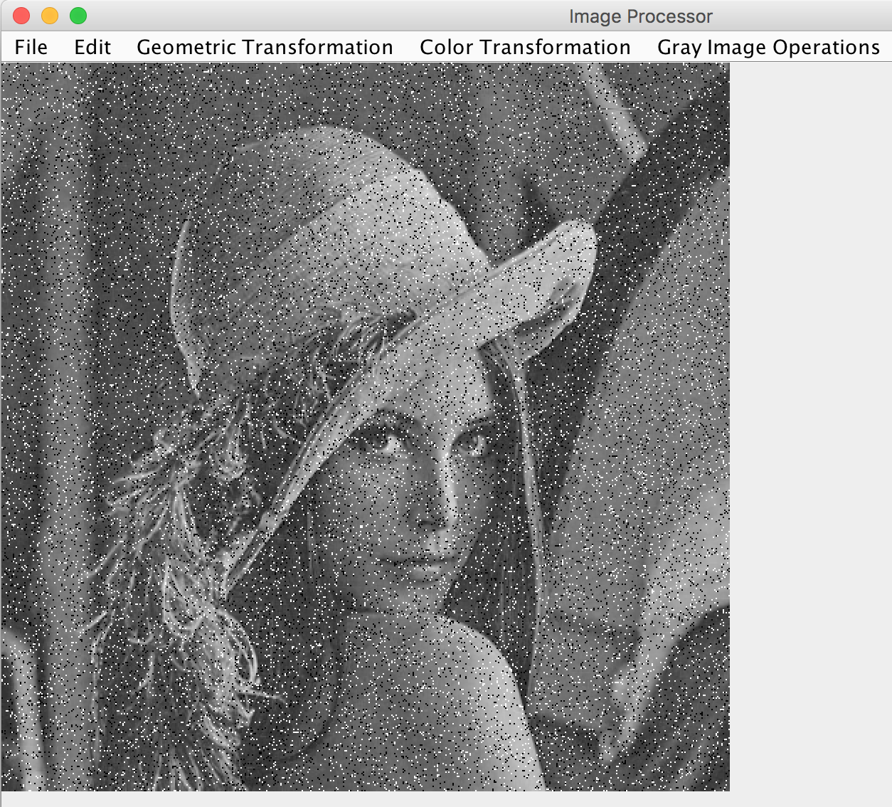
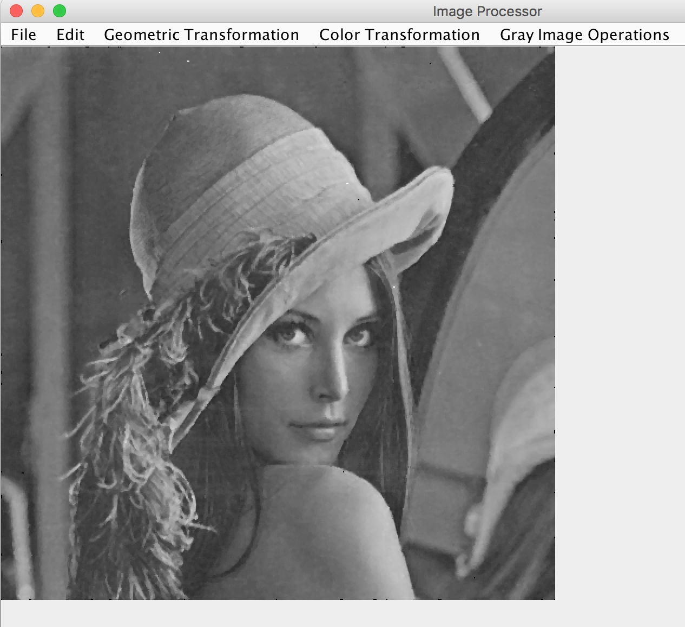

# ImageProcessor
> A tiny image processing software.
Implemented image processing algorithms like scaling/rotating, high- and low-pass filterings, de-noising, de-hazing, the Fourier Transform calculation, histogram equalization, etc. Written in Java.

## Installation & Execution
You should have JRE/JDK installed on your computer first.
Under the directory of bin, run in command line:
```sh
java -jar image_processor_en.jar
```
Or simply double click the jar file.

## Usage Example
English and Chinese language versions are provided.

Load an Image by clicking `open` under the `file` menu.


### Geometric Transformation

#### Scaling

1. Click `scale` under the `Geometric Transformation` menu.
2. Set the size you want to resize.


#### Rotation

1. Click `rotate` under the `Geometric Transformation` menu.
2. Set the angle to rotate.


### Color Transformation

#### Gray Level Transformation (Grayscale)

The RGB image will first be converted to grayscale. 
Drag the bar to change to different gray level resolusions.


#### Histogram

Calculate and show Histogram of the image.


Perform histogram equalization.



### Gray Image Operations

#### Intensity Transformations

* Negative Image
* Log Transformation

#### Low-pass Filtering (Smooth)

* Linear

  * Box Filter
  * Weighted Average Filter

* Non-linear

  * Median Filter

#### High-pass Filtering (Sharpen)

* Laplacian Filter
* Sobel Filter

#### Denoise
* Gaussian or Uniform noise
   * Arithmetic mean filter
   * Geometric mean filter
* Salt noise
   * Harmonic mean filter
   * Minimum filter
* Pepper noise
   * Contraharmonic mean filter
   * Maximum filter
* Salt and pepper noise
   * Median filter

Image with salt and pepper noise.


Denoised image using median filter algorithm.


## Meta

Zebin Xu - zebinxu7@gmail.com
